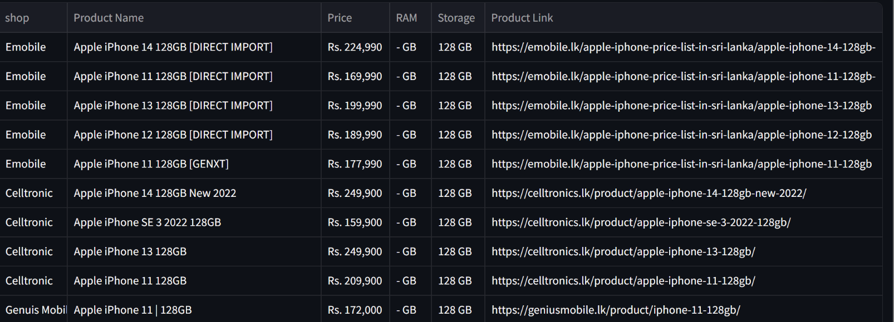

# Phone Price Comparison

## Project Overview
This project aims to compare the prices of major Sri Lankan mobile phone sellers. Prices are scraped from the respective websites and displayed in a table. Users can filter the results based on the phone model and the seller. The project is built using Python and Streamlit.

### Live Working Link
- [Phone Price Comparison App](https://phonepricecomparegit-ao2i728bwacvfjl5zqdp4t.streamlit.app/)

## Features
- **Price Comparison:** Easily compare prices from different sellers.
- **Filtering Options:** Filter results based on phone model, seller, price range, storage, and RAM.
- **Interactive Interface:** User-friendly and interactive web application built with Streamlit.

## Shops Included
1. Celltronic
2. DealzWoot
3. Doctor Mobile
4. Genius Mobile
5. Life Mobile
6. Present Solution
7. X Mobile
8. Emobile

## Libraries Used
- **Streamlit:** For building the interactive web application.
- **Pandas:** For data manipulation and analysis.
- **BeautifulSoup:** For web scraping.
- **Requests:** For making HTTP requests.
- **Numpy:** For numerical operations.
- **Openpyxl:** For reading and writing Excel files.

## New Skills Acquired
- **Web Scraping:** Extracting data from websites.
- **Streamlit:** Building interactive web applications.
- **Data Handling using Pandas:** Efficiently managing and analyzing data.

## Project Structure
```plaintext
Phone_price_compare
├── data_src
│   ├── instock_data
│   │   ├── Celltronic.xlsx...
│   ├── multiple_combined
│   │   └── Combined_data.xlsx
│   ├── ram_rom_extracted
│   │   └── Celltronic.xlsx...
│   ├── html
│   │   ├── Celltronic
│   │   │   ├── Celltronic.html
│   │   ├── DealzWoot
│   │   │   ├── DealzWoot.html
├── scripts
│   ├── Celtronic.py
│   ├── Celltronic.py
│   ├── conversion.py
│   ├── combine_all.py
│   └── All.py
└── app.py

```

## Usage
- **Clone the repository**:

```
git clone https://github.com/yourusername/Phone_price_compare.git
```
- **Navigate to the project directory:**

````
cd Phone_price_compare
````
- **Install the required libraries:**

````
pip install -r requirements.txt
````
- **Run the Streamlit app:**

````
streamlit run app.py
````

## Code Explanation
- **Celltronic.py:** Scripts for scraping prices from Celltronic.
- **conversion.py:** Handles conversion tasks for data processing.
- **combine_all.py:** Combines data from multiple sources into a single dataset.
- **All.py:** Main script to run all individual scrapers.
- **app.py:** The main application script for running the Streamlit web app.

## Example Data
Here is an example of what the filtered data looks like:



## Contributions

Contributions are welcome! Please open an issue or submit a pull request for any improvements.

## Legal

* **License**: This software is licensed under [MIT](./LICENSE).

For any questions or suggestions, please contact:

- **Name**: [savinduwickr@gmail.com]()
- **Github**: https://github.com/SavinduWickr
